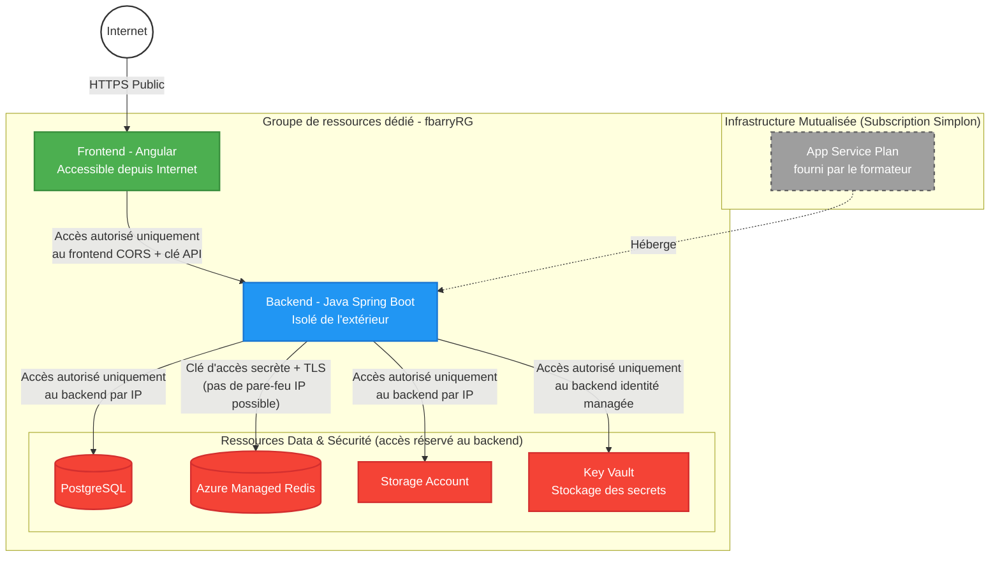

# bilan-azure-quiz-infra

## Architecture

Ce dépôt contient l'infrastructure Terraform du projet **bilan-azure-quiz**, une application de révision aux certifications Microsoft (backend Java Spring Boot + frontend Angular), déployée sur des services managés Azure.

Le schéma ci-dessous distingue deux périmètres : l'infrastructure mutualisée fournie par le formateur (App Service Plan, référencée en lecture seule, hors périmètre Terraform de l'étudiant), et le groupe de ressources dédié `fbarryRG`, entièrement géré par ce dépôt. Seul le frontend est exposé sur Internet ; le backend n'est joignable que via un CORS restreint et une clé API partagée (voir la section [Sécurité réseau](#sécurité-réseau) plus bas) ; les ressources de données ne sont accessibles que depuis le backend.

## Sécurité réseau

Le cahier des charges impose que le backend ne soit accessible que depuis le frontend. Techniquement, une **Azure Static Web App ne fait pas transiter les appels API par un serveur intermédiaire** (à moins d'utiliser un "linked backend" via Azure Functions, option payante et hors périmètre choisi ici) : le frontend est un site statique servi directement au navigateur, et c'est ce **navigateur** qui appelle l'API du backend, en HTTPS, en direct — pas un serveur du site.

En conséquence, l'endpoint HTTPS du backend (`app-fbarry-quiz-backend.azurewebsites.net`) est atteignable par n'importe qui sur Internet au niveau réseau : il n'existe pas de mécanisme d'isolation réseau strict équivalent à ce qu'on a entre le backend et PostgreSQL (pare-feu IP). C'est une limite inhérente à l'architecture "Static Web App + API publique", assumée et documentée ici plutôt que contournée par une solution plus coûteuse ou plus complexe.

Deux contrôles compensent cette exposition :

- **CORS restreint** (`APP_CORS_ALLOWED_ORIGINS`) : le backend Spring Boot n'autorise, au niveau du navigateur, que les requêtes dont l'origine correspond exactement à l'URL du frontend. Ce n'est toutefois qu'une protection côté navigateur — un client qui n'est pas un navigateur (un script `curl`, par exemple) peut envoyer n'importe quel en-tête `Origin` et n'est pas bloqué par CORS.
- **Clé API partagée** (`X-Api-Key`) : c'est la vraie barrière. Toute requête vers le backend doit porter un en-tête `X-Api-Key` dont la valeur est un secret généré aléatoirement, stocké dans Key Vault, jamais committé dans le code, et injecté dans le frontend uniquement au moment du build en CI (voir la section CI/CD plus bas). Sans cette clé, le backend rejette la requête, quelle que soit son origine.

Le trafic est en outre systématiquement chiffré en HTTPS (`https_only = true` sur l'App Service backend, Static Web App HTTPS par défaut).

Les ressources de données suivent la même logique de repli assumé et documenté :

- **PostgreSQL et Storage Account** : protégés par un pare-feu IP restreint aux adresses de sortie du backend (`azurerm_linux_web_app.backend.outbound_ip_addresses`, dérivées dynamiquement plutôt que codées en dur — voir `firewall_rules.tf` et le bloc `network_rules` de `storage_account.tf`).
- **Key Vault** : aucune restriction réseau, uniquement du contrôle d'accès par identité (RBAC — rôles `Key Vault Secrets User`/`Secrets Officer`). Ce n'est pas un oubli : Key Vault supporte bien un pare-feu IP (`network_acls`), mais l'activer casserait deux mécanismes essentiels du projet, tous deux exécutés depuis des runners GitHub Actions dont l'adresse IP change à chaque run et n'est pas prévisible à l'avance : l'écriture des secrets par le pipeline Terraform (dépôt infra), et la lecture de la clé API par le pipeline du frontend (résolution par tag, voir la section CI/CD ci-dessous). Restreindre le Key Vault par IP aurait cassé le critère de notation « CI/CD (récupération par tags) ». Le compromis retenu : un accès RBAC à privilège minimal plutôt qu'une isolation réseau incompatible avec l'architecture CI/CD choisie.

## Qualité IaC

**State distant** : le state Terraform n'est jamais stocké en local ni committé dans le dépôt (`.tfstate`, `.tfvars` et `.terraform/` sont exclus via `.gitignore`) — il est stocké dans un compte de stockage Azure dédié (`stfbarrytfstate`, conteneur `tfstate`, clé `bilan-azure-quiz.tfstate`), configuré dans `providers.tf`. L'authentification à ce state se fait via Azure AD (`storage_use_azuread = true`) plutôt que par une clé de compte de stockage partagée : l'accès est donc géré par des attributions de rôle RBAC, pas par un secret statique à faire circuler.

**Variables** : les valeurs qui peuvent varier selon le contexte (par exemple l'object id de l'administrateur humain) sont extraites dans `variables.tf` plutôt qu'écrites en dur dans les ressources — voir le journal ADR pour un exemple concret de pourquoi cette séparation est importante (`data.azurerm_client_config.current.object_id`).

**Tags** : chaque ressource créée par ce dépôt porte deux tags obligatoires, `owner = "fbarry"` et `composant = "<nom-du-composant>"` (ex. `backend`, `key-vault`, `cicd`), fusionnés depuis `local.common_tags`. Ces tags ne servent pas qu'à l'organisation/au suivi des coûts : ils sont aussi utilisés activement par le pipeline CI/CD du frontend pour retrouver dynamiquement les ressources Azure sans jamais coder leur nom en dur (voir la section CI/CD ci-dessous).

**Pas de secret en dur** : aucun mot de passe, clé ou jeton n'est écrit en clair dans le code Terraform. Les valeurs sensibles (mot de passe PostgreSQL, clé Redis, clé API partagée) sont générées aléatoirement par Terraform (`random_password`) puis stockées uniquement dans Azure Key Vault ; l'application backend les récupère au runtime via la syntaxe `@Microsoft.KeyVault(SecretUri=...)` dans ses `app_settings`, jamais en clair dans le code ou dans les logs.

## CI/CD

Chacun des 3 dépôts (`bilan-azure-quiz-infra`, `-backend`, `-frontend`) possède son propre pipeline GitHub Actions, déclenché sur chaque `push`/`pull_request` vers `main`. Le déploiement effectif (`terraform apply`, déploiement du jar, déploiement du frontend) n'a lieu que sur un `push` direct sur `main` — jamais sur une pull request, pour éviter qu'une branche non encore relue ne modifie l'environnement de prod.

**Authentification à Azure (OIDC)** : les 3 pipelines s'authentifient à Azure sans aucun mot de passe ni clé stockée en dur dans GitHub. Une identité managée dédiée (`id-github-actions-fbarry`) est fédérée à chaque dépôt via une "Federated Identity Credential" Terraform (`azurerm_federated_identity_credential`), qui n'accepte un jeton OIDC de GitHub que s'il provient précisément de ce dépôt et de la branche `main`. GitHub Actions génère ce jeton à la volée à chaque run (`permissions: id-token: write`) ; Azure AD l'échange contre un jeton d'accès de courte durée. Aucun secret à long terme ne transite donc jamais.

**Récupération des ressources par tag** (pipeline frontend) : le frontend ne connaît jamais à l'avance le nom exact des ressources Azure dont il a besoin (l'URL du backend, le nom du Key Vault). Juste avant le build (`npm run build:prod`), le pipeline se connecte à Azure (OIDC), puis interroge l'API Azure pour retrouver la Web App et le Key Vault **par leur tag `composant`** (`composant=backend`, `composant=key-vault`) plutôt que par un nom écrit en dur. Il lit ensuite la clé API partagée dans le Key Vault trouvé, et substitue ces deux valeurs (URL + clé) dans `src/environments/environment.ts` via `sed`, uniquement sur le runner CI éphémère — rien n'est jamais committé. Ce mécanisme permet de renommer ou recréer les ressources Azure sans devoir modifier le code du pipeline.

**Droits de l'identité CI** : cette identité dispose du rôle *Contributor* sur `fbarryRG` (permet de lire/écrire les ressources du groupe, y compris pour retrouver les ressources par tag) et du rôle *Key Vault Secrets User* sur `kv-fbarry-quiz` (permet de lire la valeur des secrets, mais pas de les modifier). Le déploiement du frontend utilise cependant un mécanisme différent : Azure Static Web Apps ne s'intègre pas avec OIDC/RBAC pour le déploiement lui-même, il nécessite un jeton de déploiement dédié (`AZURE_STATIC_WEB_APPS_API_TOKEN`), stocké comme secret GitHub chiffré (et non comme variable, contrairement aux identifiants OIDC qui ne sont pas sensibles).