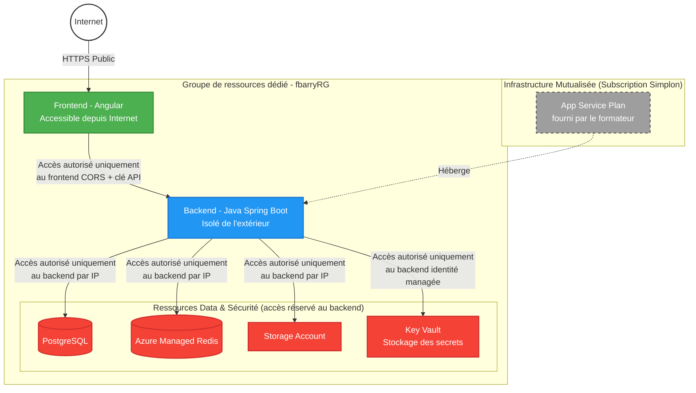

# bilan-azure-quiz-infra

## Architecture

```mermaid
flowchart TD
    %% Définition des acteurs
    Utilisateur((Internet))
    %% Infrastructure Mutualisée (Fournie par Simplon)
    subgraph "Infrastructure Mutualisée (Subscription Simplon)"
        Hote[App Service Plan\nfourni par le formateur]
    end
    %% Groupe de ressources dédié
    subgraph "Groupe de ressources dédié - fbarryRG"
        Front[Frontend - Angular\nAccessible depuis Internet]
        Back[Backend - Java Spring Boot\nIsolé de l'extérieur]
        subgraph "Ressources Data & Sécurité (accès réservé au backend)"
            DB[(PostgreSQL)]
            Redis[(Azure Managed Redis)]
            Storage[Storage Account]
            KV[Key Vault\nStockage des secrets]
        end
    end
    %% Flux réseau
    Utilisateur -->|HTTPS Public| Front
    Front -->|Accès autorisé uniquement\nau frontend CORS + clé API| Back

    Back -->|Accès autorisé uniquement\nau backend par IP| DB
    Back -->|Accès autorisé uniquement\nau backend par IP| Redis
    Back -->|Accès autorisé uniquement\nau backend par IP| Storage
    Back -->|Accès autorisé uniquement\nau backend identité managée| KV
    %% Hébergement
    Hote -.Héberge.-> Back
    %% Styles
    classDef internet fill:#fff,stroke:#333,stroke-width:2px;
    classDef public fill:#4CAF50,stroke:#388E3C,stroke-width:2px,color:white;
    classDef private fill:#F44336,stroke:#D32F2F,stroke-width:2px,color:white;
    classDef backend fill:#2196F3,stroke:#1976D2,stroke-width:2px,color:white;
    classDef mutualized fill:#9E9E9E,stroke:#616161,stroke-width:2px,color:white,stroke-dasharray: 5 5;
    class Utilisateur internet
    class Front public
    class Back backend
    class DB,Redis,Storage,KV private
    class Hote mutualized
```
